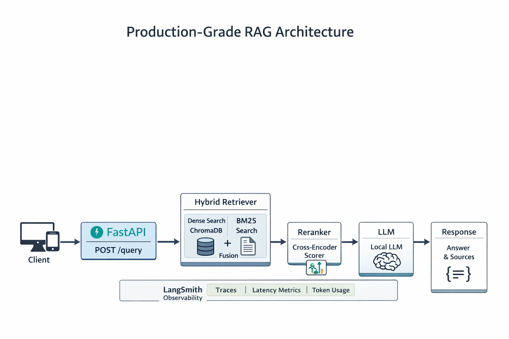
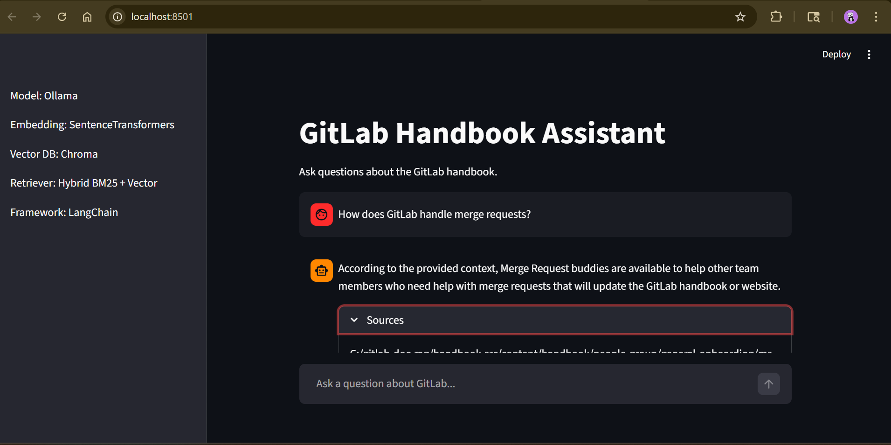
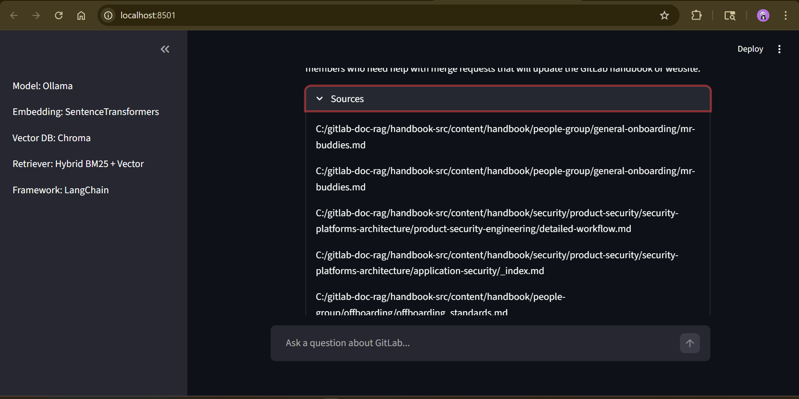

# Production-Grade Hybrid RAG System

End-to-end Retrieval-Augmented Generation system built on enterprise documentation with hybrid retrieval, reranking, evaluation, observability, and API deployment.

---

## Problem
Enterprise documentation systems are large, complex, and constantly evolving. Traditional search methods often fail because:

* Keyword search misses semantically relevant content

* Pure vector search may ignore exact policy language

* Retrieval systems lack ranking refinement

* LLM-based answers can hallucinate without grounding


Organizations need a system that:

* Retrieves accurate and relevant information

* Minimizes hallucination

* Provides traceable sources

* Is observable and measurable

* Can be deployed as a real API service

This project builds a production-style Retrieval-Augmented Generation system over GitLab handbook documentation that addresses these gaps using hybrid retrieval, cross-encoder reranking, evaluation metrics, and observability tooling.


---
<p align="center">
  
</p>

## System Architecture

Data Source
→ Markdown Ingestion
→ Heading-Aware Chunking
→ Sentence-Transformer Embeddings
→ Chroma Vector Store

Query Flow:

Client
   ↓
FastAPI API
   ↓
Hybrid Retrieval
   ├ Dense Retrieval (bi-encoder)
   ├ BM25 Retrieval
   ↓
Reciprocal Rank Fusion
   ↓
Cross-Encoder Reranking
   ↓
Local LLM (Ollama)
   ↓
Answer + Citations


## Web Interface (Streamlit)

A lightweight **Streamlit UI** provides an interactive interface for testing the RAG system.

The interface allows users to:

- Ask natural language questions
- View generated answers
- Inspect retrieved sources
- Debug retrieval quality

The UI communicates directly with the **FastAPI RAG backend**.

---

## Streamlit Interface

### Question Interface



### Answer + Sources



---

## Running the Streamlit UI

Start the API first:

```bash
uvicorn app.api:app --reload
```
Then launch the UI:
```bash
streamlit run streamlit_app.py
```
Open in your browser:
```bash
http://localhost:8501
```
The UI sends requests to the backend endpoint:
```bash
POST /query
```


Observability:

* LangSmith tracing
* Stage-level latency logging
* Token usage estimation

Evaluation:

* RAGAS (faithfulness, answer relevance, context precision)

---
## Retrieval Experiments & Design Decisions

### 1. Dense Retrieval Baseline

Initial testing used **pure dense vector retrieval** with SentenceTransformers embeddings.

**Query**
What is GitLab's incident escalation process?

### Top Results (Dense Retrieval)

| Rank | Score | Source | Observation |
|-----|------|------|------|
| 1 | 0.543 | incident-response-guidance.md | Correct security domain |
| 2 | 0.382 | incident-response-guidance.md | Duplicate section |
| 3 | 0.351 | incident-response-guidance.md | Partial relevance |
| 4 | 0.309 | infrastructure-vulnerability-procedure.md | Related but not escalation |

### Observations

Dense retrieval captured semantic similarity but showed limitations:

- Multiple chunks from the **same document dominated results**
- Important escalation content was **not surfaced early**
- The model favored **"incident response process"** instead of **"incident escalation workflow"**

**Conclusion**

Dense retrieval understands meaning but lacks lexical precision and ranking diversity.

---

## 2. Hybrid Retrieval (Dense + BM25)

To improve retrieval quality, a **hybrid retriever** combining dense embeddings and BM25 keyword search was implemented using **Reciprocal Rank Fusion (RRF)**.

### Top Results (Hybrid Retrieval)

| Rank | RRF Score | Source | Observation |
|-----|------|------|------|
| 1 | 0.0325 | incident-response-guidance.md | Strong semantic match |
| 2 | 0.0308 | incident-response-guidance.md | Incident reporting |
| 3 | 0.0166 | incident-response-guidance.md | Workflow overview |
| 4 | 0.0163 | engaging-security-on-call.md | Contains escalation workflow |
| 5 | 0.0158 | infrastructure-vulnerability-procedure.md | Security remediation |

### Improvements

Hybrid retrieval improved:

- **Recall of relevant documents**
- Inclusion of **security operations documentation**
- Better coverage of **escalation-related material**

However, ranking still favored broader **incident response guidance** rather than escalation-specific passages.

---

## 3. Chunking Improvements

Retrieval quality improved significantly after modifying the document chunking strategy.

### Changes

- Implemented **header-aware document splitting**
- Adjusted **chunk size** to preserve section context
- Increased **top_k retrieval**

### Impact

Before improvements:

- Escalation workflow content was buried deeper in results
- Irrelevant sections occasionally appeared

After improvements:

- **All top results were security-related**
- **Escalation workflow surfaced in the top 5**
- Reduced irrelevant retrieval noise

Example surfaced content:
Slack command triggers SIRT's Escalation Workflow


This indicated that **chunk granularity was previously limiting retrieval precision**.

---

## Key Retrieval Insight

The query:
What is GitLab's incident escalation process?

contains multiple semantic concepts:

- incident
- escalation
- process

Dense models strongly weight **incident response process**, which is a broader concept.

Since **escalation is a subcomponent of incident response**, the ranking behavior is logically consistent but not optimal for precise answers.

---

## 4. Why a Reranker Was Added

Even with hybrid retrieval, the system still showed:

- Bias toward broader documentation
- Highly relevant escalation passages appearing **lower in ranking**

To address this, a **cross-encoder reranker** was introduced.

### Why Reranking?

Hybrid retrieval improves **recall**, but ranking remains approximate.

A cross-encoder reranker evaluates the **query and document chunk together**, allowing more accurate relevance scoring.
(query, document chunk)

### Benefits

- Improves **ranking accuracy**
- Promotes **highly relevant passages**
- Reduces **semantic drift**

Final pipeline:
Query
↓
Hybrid Retrieval (Dense + BM25)
↓
Reranker (Cross Encoder)
↓
Top Context → LLM Generation

---

## Final Retrieval Architecture
User Query
↓
Hybrid Retriever
(Dense + BM25)
↓
RRF Fusion
↓
Top 10 Candidates
↓
Cross Encoder Reranker
↓
Top 4 Context Chunks
↓
LLM Answer Generation


---

## Engineering Takeaways

- Dense retrieval alone is **insufficient for enterprise documentation search**
- Hybrid retrieval improves **recall and lexical coverage**
- Chunking strategy strongly impacts **retrieval precision**
- Reranking improves **final context quality for LLM generation**

---

## Result

The final system retrieves:

- domain-relevant security documentation
- escalation-specific passages
- diverse sources across the handbook

This significantly improves the grounding quality of generated answers in the RAG pipeline.


## Retrieval Design

### Dense Retrieval

* Sentence-Transformers bi-encoder
* Chroma persistent vector store

### Lexical Retrieval

* BM25 using rank-bm25
* Improves recall for exact policy language and technical terms

### Hybrid Fusion

* Reciprocal Rank Fusion
* Combines semantic and lexical rankings
* Reduces single-method bias

### Cross-Encoder Reranking

* ms-marco MiniLM cross-encoder
* Joint query-document scoring
* Improves precision before LLM stage


---

## Generation

* Local LLM via Ollama
* Context-grounded prompt
* Strict instruction to avoid hallucination
* Source citation extraction
* Deduplication of references

---

## Evaluation Strategy

Implemented RAGAS for:

* Faithfulness
* Answer relevance
* Context precision

Used evaluation to diagnose:

* Recall issues due to sampling
* Ranking cutoffs
* Missing corpus coverage

---

## Observability

Integrated LangSmith for:

* End-to-end trace inspection
* Retrieval span analysis
* Rerank scoring inspection
* LLM prompt visibility
* Latency per component

Also logs:

* Retrieval latency
* Rerank latency
* Generation latency
* Token estimates


---

## API Layer

FastAPI service:

POST /query

Returns:

{
"answer": "...",
"sources": [...]
}

Containerized with Docker for portability.

---

## Tech Stack

* Python
* FastAPI
* ChromaDB
* Sentence-Transformers
* rank-bm25
* Cross-encoder reranker
* Ollama
* LangSmith
* RAGAS
* Docker

---

## Engineering Decisions

* Used hybrid retrieval to balance recall and precision
* Used a cross-encoder to mitigate dense retrieval semantic drift
* Used evaluation metrics to detect corpus sampling issues
* Added observability before scaling
* Separated ingestion, retrieval, reranking, and generation modules for maintainability

---


